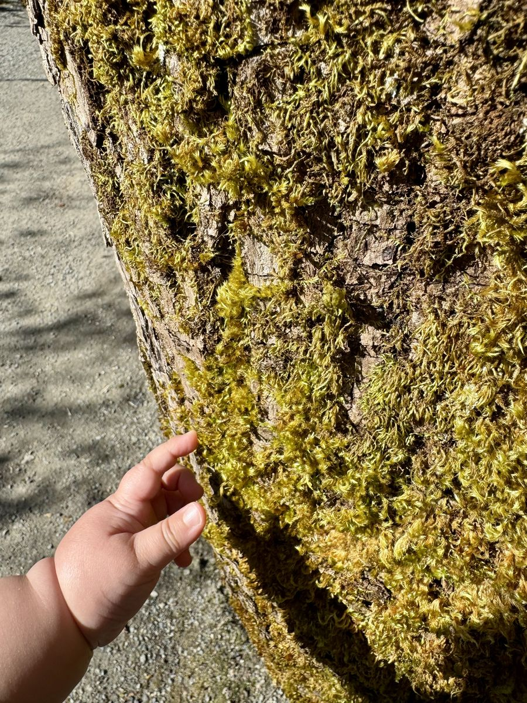
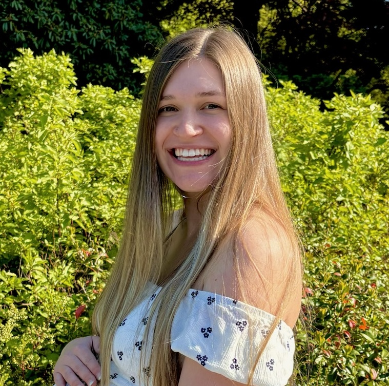
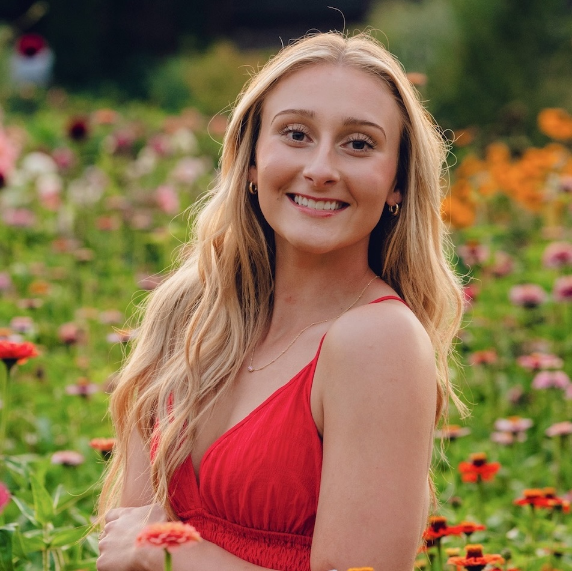

# Little Roots About Page Redesign — Claude Code Handoff

This document describes the changes to `about.html` and `css/style.css` for the About page redesign.
Make each change separately. Do not rewrite anything not listed here.

**New image to add to the repo before starting:**
Upload `images/story-photo.jpg` (the photo of Mattison and her daughter on the mossy log — provided separately).

---

## Change 1: Replace the text-only hero with a full-bleed photo hero

**Why:** The current hero is a text-only section with a gradient background — the same pattern as the old homepage. The redesign direction is photo-forward.

**Photo to use:** `images/Hero our story page.jpg` (already in the repo)

**What to do in `about.html`:**

Replace the existing `.hero` section:

```html
<!-- OLD — remove this -->
<section class="hero" style="padding: 56px 0 48px;">
  <div class="container">
    <h1>Our Story</h1>
    <p class="subtitle">How a science teacher, a toddler, and a whole lot of mud became a forest school.</p>
  </div>
</section>
```

With:

```html
<section class="about-hero">
  
  <div class="about-hero-overlay"></div>
  <div class="container">
    <h1>Our Story</h1>
    <p class="subtitle">How a science teacher, a toddler, and a whole lot of mud became a forest school.</p>
  </div>
</section>
```

**What to do in `css/style.css`:**

Add after the existing `.hero` styles:

```css
/* ===== About: Hero ===== */
.about-hero {
  position: relative;
  overflow: hidden;
  min-height: 480px;
  display: flex;
  align-items: flex-end;
  padding: 0;
}

.about-hero-img {
  position: absolute;
  inset: 0;
  width: 100%;
  height: 100%;
  object-fit: cover;
  object-position: center 30%;
  z-index: 0;
}

.about-hero-overlay {
  position: absolute;
  inset: 0;
  z-index: 1;
  background: linear-gradient(
    to bottom,
    rgba(0,0,0,.08) 0%,
    rgba(0,0,0,.02) 35%,
    rgba(0,0,0,.55) 100%
  );
}

.about-hero .container {
  position: relative;
  z-index: 2;
  padding-top: 3.5rem;
  padding-bottom: 3.5rem;
}

.about-hero h1 {
  color: var(--cream);
  font-size: 4rem;
  margin-bottom: 12px;
}

.about-hero .subtitle {
  color: rgba(255,249,240,.88);
  font-style: italic;
  font-size: 1.1rem;
  max-width: 480px;
  margin: 0;
}
```

Add inside the existing `@media (max-width: 768px)` block:

```css
  .about-hero {
    min-height: 360px;
  }

  .about-hero h1 {
    font-size: 2.8rem;
  }
```

---

## Change 2: Redesign the Our Story section

**Why:** The current layout uses `.intro-grid` (equal columns). The redesign gives the photo column more weight (narrower) and uses a sticky position on desktop so the photo stays visible while reading the longer text. The sign-off is separated visually, and a pullquote breaks up the body text.

**Photo to use:** `images/story-photo.jpg` (new file — upload before starting)

**What to do in `about.html`:**

Replace the entire `<!-- Our Story -->` section:

```html
<!-- OLD — remove this entire section -->
<section class="section">
  <div class="container">
    <div class="intro-grid">
      <div class="intro-photo">
        
      </div>
      <div class="intro-text">
        <p>Little Roots started the way most good things do. ...</p>
        ...
        <p><em>See you in the forest.</em></p>
        <p><strong>Mattison Williams</strong><br><strong>Founder and Lead Teacher</strong></p>
      </div>
    </div>
  </div>
</section>
```

With:

```html
<section class="section">
  <div class="container">
    <div class="about-story-grid">

      <div class="about-story-photo">
        
      </div>

      <div class="about-story-text">
        <p>Little Roots started the way most good things do. With a mom who couldn&rsquo;t find what she was looking for.</p>

        <p>I&rsquo;m Mattison. Before Little Roots, I taught preschool in college, which is where my love of early childhood first took root. Then I spent years as a middle school science teacher, watching kids light up when they got to touch, build, and explore instead of just sitting and listening.</p>

        <p>But when I became a mom, everything shifted. I watched my daughter reach for leaves and study bugs before she could walk, completely absorbed in the world around her. And I kept thinking, where is the space built for this? Where do toddlers and their grown-ups go to learn outside together?</p>

        <blockquote class="pullquote">The environment is the teacher. Let children lead. Trust the process.</blockquote>

        <p>The answer came when I spent time at A Little Darling School in Bellingham, WA, working alongside my mentor Netta Darling. Netta&rsquo;s philosophy is simple and powerful. Those ideas changed how I see childhood and gave me the courage to build something of my own.</p>

        <p>Little Roots Forest School is the class I wished existed when I was a new mom looking for connection, purpose, and a reason to get outside on a Thursday morning. It&rsquo;s nature-based, child-led, and built for the whole family, not just the little ones.</p>

        <div class="about-signoff">
          <span class="about-signoff-em">See you in the forest.</span>
          <p class="about-signoff-name">
            <strong>Mattison Williams</strong>
            Founder and Lead Teacher
          </p>
        </div>
      </div>

    </div>
  </div>
</section>
```

**What to do in `css/style.css`:**

Add after the existing `.intro-photo-img` styles:

```css
/* ===== About: Our Story ===== */
.about-story-grid {
  display: grid;
  grid-template-columns: 5fr 7fr;
  gap: 56px;
  align-items: start;
}

.about-story-photo {
  position: sticky;
  top: 96px;
}

.about-story-photo-img {
  width: 100%;
  aspect-ratio: 3 / 4;
  object-fit: cover;
  object-position: center 60%;
  border-radius: 16px;
  display: block;
}

.about-story-text p {
  margin-bottom: 20px;
  font-size: 1rem;
  line-height: 1.78;
}

.about-story-text p:last-child {
  margin-bottom: 0;
}

.about-signoff {
  margin-top: 36px;
  padding-top: 28px;
  border-top: 1px solid rgba(122,154,109,.3);
}

.about-signoff-em {
  font-family: 'Caveat', cursive;
  font-size: 1.6rem;
  color: var(--forest-green);
  display: block;
  margin-bottom: 14px;
}

.about-signoff-name {
  font-size: 0.95rem;
  line-height: 1.5;
  color: var(--warm-brown);
}

.about-signoff-name strong {
  display: block;
  font-weight: 600;
}
```

Add inside the existing `@media (max-width: 768px)` block:

```css
  .about-story-grid {
    grid-template-columns: 1fr;
    gap: 32px;
  }

  .about-story-photo {
    position: static;
  }

  .about-story-photo-img {
    aspect-ratio: 4 / 3;
  }
```

---

## Change 3: Redesign the Meet Your Teachers section

**Why:** The current layout uses white card boxes with small circular photos. The redesign uses larger rectangular portrait photos with credentials listed beneath — more editorial, less "team widget."

**What to do in `about.html`:**

Replace the entire `<!-- Meet Your Teachers -->` section:

```html
<!-- OLD — remove this entire section -->
<section class="section section--alt">
  <div class="container">
    <h2 class="section-title">Meet Your Teachers</h2>
    <div class="teacher-cards">
      <div class="teacher-card"> ... </div>
      <div class="teacher-card"> ... </div>
    </div>
  </div>
</section>
```

With:

```html
<section class="section section--alt">
  <div class="container">
    <h2 class="section-title">Meet Your Teachers</h2>

    <div class="about-teachers-grid">

      <div class="about-teacher">
        <div class="about-teacher-photo">
          
        </div>
        <h3>Mattison Williams</h3>
        <span class="about-teacher-role">Founder &amp; Lead Teacher</span>
        <ul class="about-teacher-creds">
          <li>Licensed Washington State educator</li>
          <li>Former preschool &amp; middle school science teacher (NGSS)</li>
          <li>Pediatric CPR &amp; First Aid certified</li>
          <li>Mom to one nature-loving girl who&rsquo;ll be right there with your little ones every Thursday</li>
        </ul>
      </div>

      <div class="about-teacher">
        <div class="about-teacher-photo">
          
        </div>
        <h3>Katelyn</h3>
        <span class="about-teacher-role">Co-Teacher</span>
        <ul class="about-teacher-creds">
          <li>Early childhood education student</li>
          <li>YMCA youth program leader &mdash; coach, referee, summer camp</li>
          <li>Pediatric CPR &amp; First Aid certified</li>
          <li>The calm, steady presence your little ones will love having in the forest every Thursday</li>
        </ul>
      </div>

    </div>
  </div>
</section>
```

**What to do in `css/style.css`:**

Add after the existing `.teacher-card` styles:

```css
/* ===== About: Teachers (redesign) ===== */
.about-teachers-grid {
  display: grid;
  grid-template-columns: 1fr 1fr;
  gap: 40px;
  max-width: 840px;
  margin: 0 auto;
}

.about-teacher-photo {
  width: 100%;
  aspect-ratio: 3 / 4;
  border-radius: 12px;
  overflow: hidden;
  margin-bottom: 20px;
}

.about-teacher-photo img {
  width: 100%;
  height: 100%;
  object-fit: cover;
  object-position: center top;
  display: block;
}

.about-teacher h3 {
  font-size: 1.9rem;
  margin-bottom: 2px;
}

.about-teacher-role {
  font-size: 0.88rem;
  font-style: italic;
  color: var(--sage-text);
  margin-bottom: 16px;
  display: block;
}

.about-teacher-creds {
  list-style: none;
  display: flex;
  flex-direction: column;
  gap: 6px;
  padding-top: 14px;
  border-top: 1px solid rgba(122,154,109,.25);
}

.about-teacher-creds li {
  font-size: 0.88rem;
  line-height: 1.5;
  color: var(--warm-brown);
  padding-left: 14px;
  position: relative;
}

.about-teacher-creds li::before {
  content: '';
  position: absolute;
  left: 0;
  top: 8px;
  width: 5px;
  height: 5px;
  border-radius: 50%;
  background-color: var(--sage);
}
```

Add inside the existing `@media (max-width: 768px)` block:

```css
  .about-teachers-grid {
    grid-template-columns: 1fr;
    max-width: 400px;
  }

  .about-teacher-photo {
    aspect-ratio: 1 / 1;
  }
```

---

## Change 4: Redesign the What We Believe section

**Why:** The alternating tinted `.belief-block` pattern is mechanical. The redesign uses a clean single-column list with thin divider lines and more breathing room per belief.

**What to do in `about.html`:**

Replace the entire `<!-- What We Believe -->` section:

```html
<!-- OLD — remove this entire section -->
<section class="section">
  <div class="container">
    <h2 class="section-title">What We Believe</h2>
    <div class="belief-block"> ... </div>
    <div class="belief-block belief-block--tinted"> ... </div>
    <div class="belief-block"> ... </div>
    <div class="belief-block belief-block--tinted"> ... </div>
    <div class="belief-block"> ... </div>
  </div>
</section>
```

With:

```html
<section class="section">
  <div class="container">
    <h2 class="section-title">What We Believe</h2>

    <div class="about-beliefs">

      <div class="about-belief">
        <h3>The forest is the classroom.</h3>
        <p>We don&rsquo;t bring worksheets outside. We let sticks and puddles and pinecones do the teaching. Every rock is a math lesson. Every bug is a science experiment. Every muddy handprint is art.</p>
      </div>

      <div class="about-belief">
        <h3>Kids lead, we follow.</h3>
        <p>If your toddler wants to poke the same mushroom for fifteen minutes, we let them. That deep focus? That IS learning. We&rsquo;re not here to rush anyone through a checklist.</p>
      </div>

      <div class="about-belief">
        <h3>Everyone teaches, everyone learns.</h3>
        <p>You&rsquo;re not here to watch from a bench &mdash; you&rsquo;re part of the class. At Little Roots, grown-ups learn alongside their children, noticing what they notice and wondering what they wonder. By Week 3, you&rsquo;ll catch yourself saying things like &ldquo;I notice&hellip;&rdquo; and &ldquo;I wonder&hellip;&rdquo; at the grocery store. That&rsquo;s the goal.</p>
      </div>

      <div class="about-belief">
        <h3>Everything has a purpose.</h3>
        <p>When your baby dumps a cup of water for the 47th time, they&rsquo;re not being difficult &mdash; they&rsquo;re studying gravity and cause and effect. We&rsquo;ll help you see the learning that&rsquo;s already happening in their play.</p>
      </div>

      <div class="about-belief">
        <h3>This is for you, too.</h3>
        <p>Parenting little ones can feel isolating, especially in the PNW rain. Little Roots is a community &mdash; a place where you can connect with other families who care about the same things you do. You&rsquo;ll leave each session with ideas, confidence, and maybe a friend who also doesn&rsquo;t mind their kid eating dirt.</p>
      </div>

    </div>
  </div>
</section>
```

**What to do in `css/style.css`:**

Add after the existing `.belief-block` styles:

```css
/* ===== About: What We Believe (redesign) ===== */
.about-beliefs {
  max-width: 720px;
  margin: 0 auto;
}

.about-belief {
  padding: 32px 0;
  border-bottom: 1px solid rgba(122,154,109,.18);
}

.about-belief:first-child {
  padding-top: 0;
}

.about-belief:last-child {
  border-bottom: none;
  padding-bottom: 0;
}

.about-belief h3 {
  font-size: 2rem;
  margin-bottom: 10px;
  line-height: 1.15;
}

.about-belief p {
  font-size: 0.96rem;
  line-height: 1.75;
  max-width: 62ch;
}
```

Add inside the existing `@media (max-width: 768px)` block:

```css
  .about-belief h3 {
    font-size: 1.7rem;
  }
```

---

## Change 5: Replace the CTA section background

**Why:** The current CTA uses `text-align: center` with no background — it blends into the section above. The redesign gives it a sage-light background to close the page clearly.

**What to do in `about.html`:**

Replace:

```html
<section class="section cta-section">
  <div class="container" style="text-align: center;">
    <h2 class="section-title">Ready to join us in the forest?</h2>
    <a href="register.html" class="btn">Register for Little Roots</a>
  </div>
</section>
```

With:

```html
<section class="about-cta">
  <div class="container">
    <h2 class="section-title">Ready to join us in the forest?</h2>
    <a href="register.html" class="btn">Register for Little Roots</a>
  </div>
</section>
```

**What to do in `css/style.css`:**

Add:

```css
/* ===== About: CTA ===== */
.about-cta {
  background-color: var(--sage-light);
  text-align: center;
  padding: 72px 0;
}

.about-cta .section-title {
  margin-bottom: 24px;
}
```

---

## Order of operations

1. Upload `images/story-photo.jpg` first
2. Apply Change 1 (hero) and test at mobile (375px)
3. Apply Change 2 (Our Story) — sticky photo only kicks in above 768px, verify at both breakpoints
4. Apply Change 3 (Teachers)
5. Apply Change 4 (What We Believe)
6. Apply Change 5 (CTA)
7. Deploy to Netlify and check on a real device — the sticky photo column in Change 2 is worth verifying on actual mobile hardware
