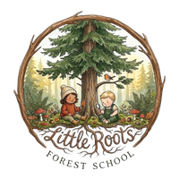

# Little Roots Homepage Redesign — Claude Code Handoff

This document describes four specific changes to `index.html` and `css/style.css`.
Make each change separately. Do not rewrite anything not listed here.

---

## Change 1: Add a photo hero

**Why:** The current hero uses a CSS gradient background. Replacing it with a real photo makes a much stronger first impression.

**Photo to use:** `images/Hero.jpg` (already in the repo — a parent and toddler sitting on a mossy log beneath tall trees, looking up at the forest canopy)

**What to do in `index.html`:**

Inside the `.hero` section, add a full-bleed background image. The existing hero text, subtitle, summer details, and CTA button should remain exactly as-is, displayed over the photo.

The image should:
- Fill the entire hero area (use `object-fit: cover`)
- Be positioned so the figures are visible — use `object-position: center 65%`
- Have a gradient overlay on top of it so text stays readable: transparent at the top, roughly 60% dark at the bottom

**What to do in `css/style.css`:**

Update the `.hero` styles to:
- Remove the existing `background` radial/linear gradient
- Set `position: relative` and `overflow: hidden`
- Keep existing padding

Add a new `.hero-img` class:
```css
.hero-img {
  position: absolute;
  inset: 0;
  width: 100%;
  height: 100%;
  object-fit: cover;
  object-position: center 65%;
  z-index: 0;
}
```

Add a `.hero-overlay` class for the gradient:
```css
.hero-overlay {
  position: absolute;
  inset: 0;
  z-index: 1;
  background: linear-gradient(
    to bottom,
    rgba(0,0,0,.12) 0%,
    rgba(0,0,0,.0) 30%,
    rgba(0,0,0,.0) 45%,
    rgba(0,0,0,.6) 100%
  );
}
```

Set `position: relative; z-index: 2` on the `.container` inside `.hero` so text sits above the overlay.

Update hero text colors so they read on the photo:
- `h1` inside `.hero`: `color: var(--cream)`
- `.subtitle` inside `.hero`: `color: rgba(255,249,240,.88)`, add `font-style: italic`
- `.summer-dates`, `.summer-info` inside `.hero`: `color: rgba(255,249,240,.85)`
- `.btn` inside `.hero` keeps its existing styles (already cream text on forest green — this works)

---

## Change 2: Replace the pricing banner with a Founding Families banner

**Why:** The current `.pricing-banner` interrupts the emotional flow right after the hero. The founding families offer is a stronger hook and deserves that position. Pricing belongs inside the "What Is" section where it has context.

**What to do in `index.html`:**

1. Remove the entire `.pricing-banner` section.

2. Directly after the closing `</section>` tag of the hero, add a new banner:

```html
<div class="founding-banner">
  <p><strong>Founding Families Offer:</strong> Enroll in our June session and your $49 registration fee is waived. <a href="/faq#founding-families">Learn more &rarr;</a></p>
</div>
```

3. Inside the `.intro-text` div in the "What Is Little Roots" section, add the following pricing block after the last `<p>` tag:

```html
<div class="pricing-block">
  <div class="price-row">
    <span>Monthly tuition</span>
    <span class="price-amount">$99</span>
  </div>
  <div class="price-row">
    <span>One-time registration fee</span>
    <span class="price-amount">$49</span>
  </div>
</div>
```

**What to do in `css/style.css`:**

Remove or comment out the existing `.pricing-banner`, `.pricing-banner-text`, and `.pricing-banner-note` styles.

Add new styles:

```css
.founding-banner {
  background-color: var(--forest-green);
  color: var(--cream);
  text-align: center;
  padding: 14px 5%;
  font-size: .92rem;
}

.founding-banner strong {
  color: #c8e6b8;
}

.founding-banner a {
  color: #c8e6b8;
  text-decoration: underline;
}

.pricing-block {
  margin-top: 24px;
  padding-top: 20px;
  border-top: 1px solid rgba(122, 154, 109, .3);
  display: flex;
  flex-direction: column;
  gap: 8px;
}

.price-row {
  display: flex;
  justify-content: space-between;
  align-items: baseline;
  font-size: .95rem;
}

.price-amount {
  font-family: 'Caveat', cursive;
  font-size: 1.4rem;
  font-weight: 700;
  color: var(--forest-green);
}
```

---

## Change 3: Replace the schedule card grid with a vertical timeline

**Why:** The 2-column card grid is harder to read on mobile. A vertical timeline with times on the left reads more naturally at toddler pace — which matches the tone of the content.

**What to do in `index.html`:**

Replace the contents of the `.timeline` div with this structure (keep the same 6 items, same copy):

```html
<div class="timeline">

  <div class="tl-item">
    <div class="tl-time">9:30</div>
    <div class="tl-body">
      <h3>Arrival &amp; Free Explore</h3>
      <p>Stations are already set up when you walk in. Your child can start exploring right away while everyone settles in.</p>
    </div>
  </div>

  <div class="tl-item">
    <div class="tl-time">9:45</div>
    <div class="tl-body">
      <h3>Stations</h3>
      <p>Mud kitchen, sensory play, art, motor skills, nature exploration, and more. Your child moves freely between them &mdash; no one tells them where to go or when to rotate.</p>
    </div>
  </div>

  <div class="tl-item">
    <div class="tl-time">10:05</div>
    <div class="tl-body">
      <h3>Morning Circle</h3>
      <p>A gathering song, a story, and an introduction to the day&rsquo;s nature focus with something real to touch and hold.</p>
    </div>
  </div>

  <div class="tl-item">
    <div class="tl-time">10:20</div>
    <div class="tl-body">
      <h3>Snack &amp; Songs</h3>
      <p>We sit together while everyone enjoys their own snacks. A second shorter book and a song to get our wiggles out.</p>
    </div>
  </div>

  <div class="tl-item">
    <div class="tl-time">10:30</div>
    <div class="tl-body">
      <h3>Nature Walk</h3>
      <p>We head out on the forest loop trail together at toddler pace. We collect, observe, wonder out loud, and let the children lead the way.</p>
    </div>
  </div>

  <div class="tl-item">
    <div class="tl-time">~10:55</div>
    <div class="tl-body">
      <h3>Closing Circle</h3>
      <p>We share one discovery, sing our closing song, and say goodbye to the forest together.</p>
    </div>
  </div>

</div>
```

**What to do in `css/style.css`:**

Replace the existing `.timeline` and `.timeline-card` styles with:

```css
.timeline {
  display: flex;
  flex-direction: column;
  max-width: 640px;
  margin: 0 auto;
}

.tl-item {
  display: grid;
  grid-template-columns: 72px 1fr;
  gap: 0 20px;
  padding-bottom: 28px;
}

.tl-time {
  font-family: 'Caveat', cursive;
  font-size: 1.2rem;
  color: var(--sage-text);
  text-align: right;
  padding-top: 2px;
}

.tl-body {
  border-left: 1px solid rgba(122, 154, 109, .35);
  padding-left: 20px;
}

.tl-item:last-child .tl-body {
  border-left-color: transparent;
}

.tl-body h3 {
  font-size: 1.5rem;
  margin-bottom: 4px;
}

.tl-body p {
  font-size: .93rem;
  line-height: 1.65;
}
```

Also remove the existing `.card-icon`, `.timeline-card`, and `.card-time` styles — they are no longer used on this page. (Check other pages first — if `.timeline-card` is used elsewhere, don't remove it from the stylesheet.)

---

## Change 4: Give the Crown Ceremony section a full-bleed photo background

**Why:** The Crown Ceremony is the emotional closing of the homepage and the last thing a parent reads before deciding to register. It deserves real visual presence — not just a gradient.

**Photo to use:** `images/moss-tree-hand.jpg` (already in the repo)

**What to do in `index.html`:**

Replace the `.crown-callout` section with:

```html
<section class="crown-callout crown-photo-section">
  
  <div class="crown-photo-overlay"></div>
  <div class="container">
    <div class="crown-callout-content">
      <h2 class="section-title">Every season, the class builds a crown together.</h2>
      <p>Each child walks out of the forest wearing something their whole class made, season after season. It&rsquo;s one of our favorite traditions at Little Roots.</p>
      <a class="btn" href="/register">Register for Little Roots</a>
    </div>
  </div>
</section>
```

**What to do in `css/style.css`:**

Add to the existing `.crown-callout` styles (don't remove what's there):

```css
.crown-photo-section {
  position: relative;
  overflow: hidden;
  min-height: 420px;
  display: flex;
  align-items: flex-end;
  padding: 0;
}

.crown-bg-img {
  position: absolute;
  inset: 0;
  width: 100%;
  height: 100%;
  object-fit: cover;
  object-position: center 40%;
  z-index: 0;
}

.crown-photo-overlay {
  position: absolute;
  inset: 0;
  background: linear-gradient(to bottom, rgba(12,32,14,.05) 0%, rgba(12,32,14,.78) 100%);
  z-index: 1;
}

.crown-photo-section .container {
  position: relative;
  z-index: 2;
  padding-top: 3rem;
  padding-bottom: 3rem;
}

.crown-photo-section .crown-callout-content {
  text-align: left;
}

.crown-photo-section .section-title,
.crown-photo-section p {
  color: var(--cream);
}

.crown-photo-section .section-title {
  font-size: 2.2rem;
}
```

---

## Change 5: Add logo to footer

**Why:** The footer is dark forest green — adding the logo above the tagline anchors the brand before the sign-off and gives parents one more visual touchpoint before they decide to register.

**What to do in `index.html`:**

Inside `.site-footer`, directly before the `.footer-tagline` paragraph, add:

```html

```

**What to do in `css/style.css`:**

Add:

```css
.footer-logo {
  width: 110px;
  height: 110px;
  object-fit: contain;
  border-radius: 50%;
  display: block;
  margin: 0 auto 1.5rem;
}
```

Also update the existing `.logo-img` class (header logo) from `height: 44px; width: 44px` to:

```css
.logo-img {
  height: 52px;
  width: 52px;
  object-fit: contain;
  border-radius: 50%;
}
```

---

## Order of operations

Implement these in order. Test on mobile (375px) after each one before moving to the next. The site should deploy to Netlify after each change via your normal Claude Code → push to main workflow.

Upload `images/Hero.jpg` to the repo `images/` folder before starting Change 1.
